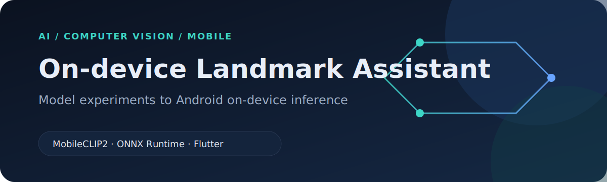
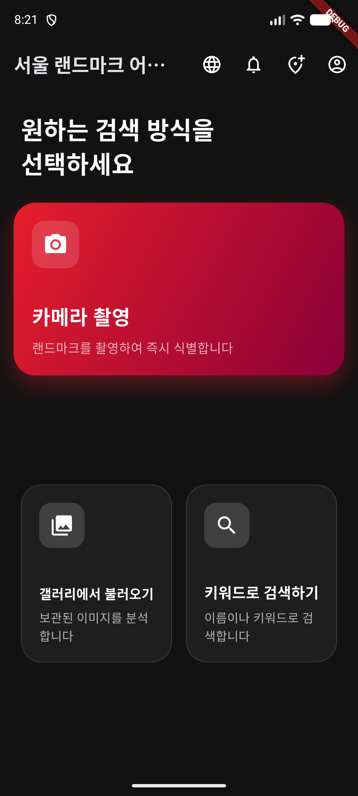
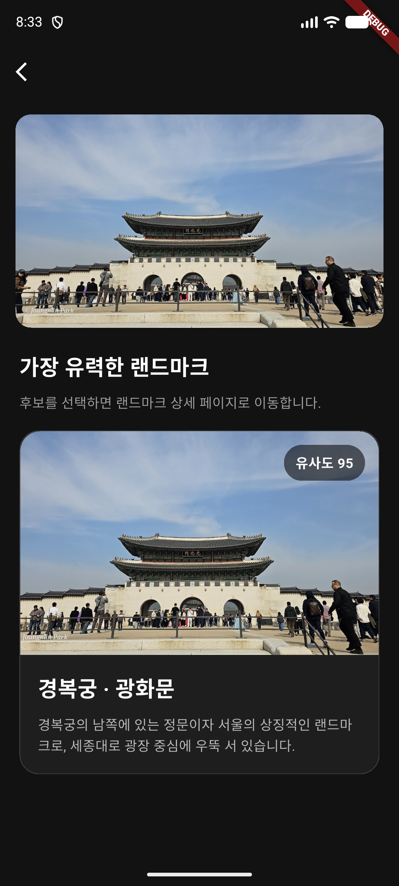
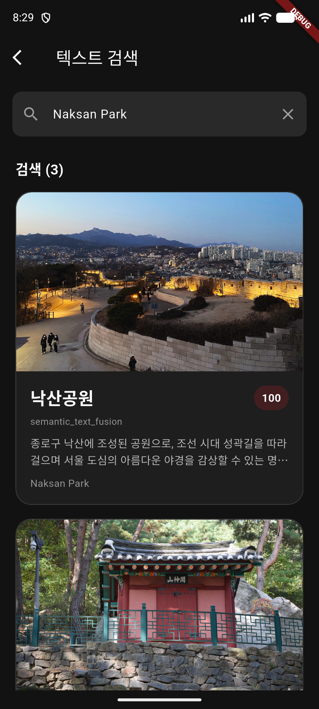
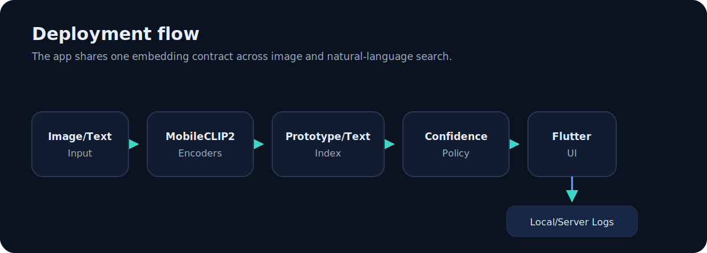
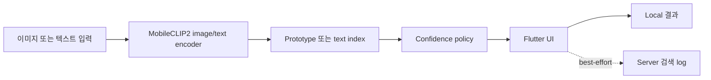
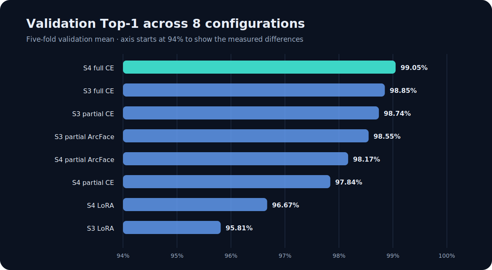
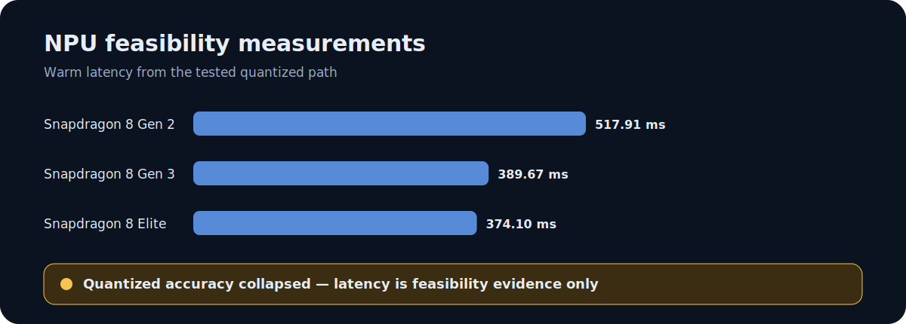

<p align="right">
  <a href="README.md"><kbd>English</kbd></a> <strong><kbd>한국어</kbd></strong>
</p>

<p align="center">
  
</p>

MobileCLIP2 모델 실험을 ONNX Runtime과 Flutter 기반 Android on-device 이미지·텍스트 추론으로 연결한 랜드마크 안내 앱입니다.

<p align="center">
  <a href="https://landmark-assistant-sprint1.vercel.app/">프로젝트 문서</a> ·
  <a href="https://landmark-assistant-sprint1.vercel.app/experiments/paper/sprint2-main-matrix-results-2026-06-15.html">실험 결과</a> ·
  <a href="https://github.com/lpcvc-2026-CNU/App">팀 앱 소스</a>
</p>

## 프로젝트 개요

이 앱은 서울 랜드마크 23개 class를 대상으로 두 가지 local 검색 방식을 지원합니다.

- **이미지 검색:** 사진을 embedding으로 변환하고 class prototype과 비교한 뒤, confidence 판정과 함께 후보 순위를 보여줍니다.
- **텍스트 검색:** 자연어 query를 embedding으로 변환하고 semantic score와 keyword score를 결합해 관련 랜드마크를 반환합니다.

최종 Android handoff에는 분리된 FP16 image/text ONNX encoder를 사용했습니다. 모델 metadata, 전처리 parameter, class 순서, threshold, artifact 경로는 공통 serving contract를 통해 읽습니다.

| 지원 class | 주요 실험 run | 최종 모델 artifact | Confidence 상태 |
| ---: | ---: | --- | --- |
| 23 | 40 (8 configs × 5 folds) | FP16 image/text ONNX | `matched`, `ambiguous`, `out_of_scope`, `low_quality` |

## 앱 동작

<table>
  <tr>
    <td width="33%" align="center"></td>
    <td width="33%" align="center"></td>
    <td width="33%" align="center"></td>
  </tr>
  <tr>
    <td align="center">1. 입력 방식 선택</td>
    <td align="center">2. 이미지 후보 확인</td>
    <td align="center">3. 텍스트로 검색</td>
  </tr>
</table>

이미지 결과는 프로젝트 asset에 포함된 비개인 sample로 캡처했습니다. Local inference log에는 `gwanghwamun=0.9518`과 `matched` 판정이 기록됐습니다. 텍스트 예시는 `Naksan Park` query를 사용하며 결과 3개를 반환합니다.

## 시스템 설계





이미지 검색과 텍스트 검색은 동일한 embedding contract를 사용하지만, 서로 다른 index와 판정 logic을 사용합니다. 이미지 검색은 image embedding을 landmark prototype과 비교합니다. 텍스트 검색은 semantic similarity와 keyword 근거를 결합한 뒤 결과 순위를 계산합니다.

Server log는 추론에 필수 요소가 아닙니다. Local 캡처 당시 backend가 실행되지 않은 상태였지만 두 검색 모두 완료됐습니다.

## 코드 둘러보기

실제 핵심 source는 프로젝트 진행 순서에 맞춰 정리했습니다.

1. [`code/training/`](code/training/) — 실제 dataset, model, loss, training, evaluation, ONNX export 코드와 개인정보를 제거한 8개 config matrix
2. [`code/sprint1_prototype/`](code/sprint1_prototype/) — 이미지·텍스트 검색과 confidence 동작을 검증한 당시 Streamlit prototype
3. [`code/model_integration/`](code/model_integration/) — 실제 serving contract metadata, validation/semantic artifact script, Android asset-cache 수정 patch

출처는 [`code/SOURCES.md`](code/SOURCES.md), 설계·직접 구현·팀 구현의 구분은 [`code/CONTRIBUTIONS.md`](code/CONTRIBUTIONS.md)에 기록했습니다.

## 실험 근거



주요 모델 선택 기준은 **5-fold validation mean**이었습니다. Hard negative를 사용한 S4 full CE가 **99.05% validation Top-1**로 가장 높았고, held-out test Top-1은 **98.67%**, macro F1은 **97.11%**였습니다. Macro F1과 low-margin 개수는 보조 지표로 사용했습니다. Test 결과를 근거로 validation 기반 선택 순서를 뒤집지 않았습니다.

이 수치는 23개 class로 구성된 소규모 **closed-set** dataset에서 측정한 결과입니다. Open-world 인식 정확도를 의미하지 않습니다.

## 배포 결과

Sprint 1 dynamic INT8은 테스트한 CPU 환경에서 FP32와 가까운 embedding 방향을 유지했으며(`cosine mean = 0.99941`), ORT CPU path에서 `314 ms` warm median을 기록했습니다. 최종 Sprint 2 Android handoff는 이와 달리 FP16 mixed-precision image/text encoder를 사용합니다.



테스트한 quantized NPU artifact에서는 latency를 측정할 수 있었지만 정확도가 붕괴했습니다. 따라서 이 수치는 feasibility 근거로만 남겼으며, 성공적인 최적화 결과로 제시하지 않습니다.

## 담당 범위

| 내가 직접 담당한 작업 | 공동 결정 또는 팀 구현 |
| --- | --- |
| 모델 학습과 실험 설계 | 프로젝트 방향과 범위 설정(팀 공동) |
| 평가 기준과 실패 분석 | 최종 Flutter/Android 구현 |
| On-device 모델 연동, artifact/serving contract, validation과 debugging | Auth 기능과 계정 flow |
| Sprint 1 demo app 설계 및 구현 | 알림 기능 |
| 랜드마크 인식 architecture와 model-to-app integration flow 설계 | 건의 기능 |
| 기술 문서와 handoff 정리 | 앱 UI 설계 및 구현 |
|  | 팀원이 구현한 초기 app-side 구조와 기타 앱 기능 |

이 repository는 프로젝트 case study이며, 최종 팀 애플리케이션의 모든 코드를 한 사람이 작성했다는 의미가 아닙니다. 선별한 training, prototype, integration source는 포함했지만 모델 binary와 팀원이 작성한 최종 Flutter/Android 파일은 복사하지 않고 관련 commit으로 연결했습니다.

## 한계

- 정확도는 23개 class의 소규모 closed-set dataset에서 측정했습니다.
- Open-world generalization은 검증하지 않았습니다.
- 최종 FP16 artifact의 NPU backend 정확도는 검증하지 않았습니다.
- 최종 model bundle이 크며 실제 배포용 mobile package 크기까지 줄이지 못했습니다.
- Real-time 성능을 달성했다고 주장하지 않습니다.
- Emulator 최초 실행 시 앱이 응답 가능한 상태가 되기 전에 모델 복사와 session 초기화 시간이 필요했습니다.

## 근거 자료

- [프로젝트 문서 모음](https://landmark-assistant-sprint1.vercel.app/)
- [Sprint 2 주요 실험 matrix](https://landmark-assistant-sprint1.vercel.app/experiments/paper/sprint2-main-matrix-results-2026-06-15.html)
- [Model serving contract](https://landmark-assistant-sprint1.vercel.app/operations/model-serving-contract.html)
- [Mobile artifact benchmark](https://landmark-assistant-sprint1.vercel.app/experiments/sprint1-mobile-artifact-benchmark-2026-05-16.html)
- [Flutter on-device 앱 architecture](https://landmark-assistant-sprint1.vercel.app/operations/flutter-ondevice-app-architecture.html)
- [팀 애플리케이션 소스](https://github.com/lpcvc-2026-CNU/App)

Source application contract check는 2026-06-20에 다시 실행했습니다. **Python check 10개와 Flutter test 4개가 통과**했습니다. 이 case-study repository의 chart data와 asset 검증 코드는 [`data/metrics.json`](data/metrics.json)과 [`tests/test_portfolio_assets.py`](tests/test_portfolio_assets.py)에 있습니다.

## Portfolio asset 재생성

Chart 생성에는 Python standard library만 사용합니다.

```powershell
python scripts/generate_visuals.py
python -m unittest discover -s tests -v
```
