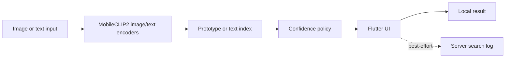

<p align="right">
  <strong><kbd>English</kbd></strong> <a href="README.ko.md"><kbd>한국어</kbd></a>
</p>

<p align="center">
  
</p>

An Android landmark assistant that connects MobileCLIP2 model experiments to local image and text inference through ONNX Runtime and Flutter.

<p align="center">
  <a href="https://landmark-assistant-sprint1.vercel.app/">Documentation</a> ·
  <a href="https://landmark-assistant-sprint1.vercel.app/experiments/paper/sprint2-main-matrix-results-2026-06-15.html">Experiment results</a> ·
  <a href="https://github.com/lpcvc-2026-CNU/App">Team app source</a>
</p>

## What this project does

The app supports two local search paths over 23 Seoul landmark classes:

- **Image search:** encode a photo, compare it with class prototypes, and show ranked candidates with a confidence decision.
- **Text search:** encode a natural-language query, combine semantic and keyword scores, and return matching landmarks.

The final Android handoff uses separate FP16 image and text ONNX encoders. Model metadata, preprocessing parameters, class order, thresholds, and artifact paths are read through a shared serving contract.

| Supported classes | Main experiment runs | Final model artifacts | Confidence states |
| ---: | ---: | --- | --- |
| 23 | 40 (8 configs × 5 folds) | FP16 image/text ONNX | `matched`, `ambiguous`, `out_of_scope`, `low_quality` |

## App flow

<table>
  <tr>
    <td width="33%" align="center"></td>
    <td width="33%" align="center"></td>
    <td width="33%" align="center"></td>
  </tr>
  <tr>
    <td align="center">1. Select an input path</td>
    <td align="center">2. Review image candidates</td>
    <td align="center">3. Search by text</td>
  </tr>
</table>

The image result was captured with a non-personal sample from the project assets. The local inference log reported `gwanghwamun=0.9518` and the `matched` decision. The text example uses the query `Naksan Park` and returns three results.

## System design




Image and text retrieval share an embedding contract, but use different indexes and decision logic. Image search compares an image embedding with landmark prototypes. Text search fuses semantic similarity with keyword evidence before ranking results.

The server log is not required for inference. During the local capture, the backend was unavailable and the app still completed both searches.

## Code walkthrough

The curated source is organized by the same engineering sequence:

1. [`code/training/`](code/training/) — actual dataset, model, loss, training, evaluation and ONNX export source, plus the sanitized eight-config matrix.
2. [`code/sprint1_prototype/`](code/sprint1_prototype/) — the tracked Streamlit prototype used to validate image/text search and confidence behavior.
3. [`code/model_integration/`](code/model_integration/) — actual serving-contract metadata, validation and semantic-artifact scripts, and the Android asset-cache fix.

[`code/SOURCES.md`](code/SOURCES.md) records provenance. [`code/CONTRIBUTIONS.md`](code/CONTRIBUTIONS.md) separates design, direct implementation and team implementation.

## Experiment evidence


The primary selection rule was the **five-fold validation mean**. S4 full CE with hard negatives ranked first at **99.05% validation Top-1**; its held-out test Top-1 was **98.67%**, with **97.11% macro F1**. Macro F1 and low-margin counts were supporting signals. Test results were not used to reverse the validation-based selection rule.

These figures measure a small **closed-set** dataset of 23 classes. They are not open-world recognition accuracy.

## Deployment findings

Sprint 1 dynamic INT8 preserved the tested FP32 embedding direction closely (`cosine mean = 0.99941`) and recorded a `314 ms` warm median on the tested ORT CPU path. The final Sprint 2 Android handoff instead uses FP16 mixed-precision image and text encoders.


The tested quantized NPU artifact produced latency measurements, but its accuracy collapsed. Those numbers are retained only as feasibility evidence; they are not presented as a successful optimized model result.

## My contribution

| My direct work | Shared or team-implemented work |
| --- | --- |
| Model training and experiment design | Project direction and scope (shared) |
| Evaluation rules and failure analysis | Final Flutter/Android implementation |
| Model artifact, serving contract and integration validation | Auth feature and account flow |
| Sprint 1 demo app design and implementation | Notification feature |
| Landmark-recognition architecture and model-to-app integration flow | Suggestion feature |
| Technical documentation and handoff | App UI design and implementation |
|  | Additional integration work by team members |

This repository is a portfolio case study, not a claim that every line of the final team application was written by one person. It includes curated training, prototype and integration source. Model binaries and teammates' final Flutter/Android files are intentionally not copied here; the relevant team commits are linked instead.

## Limitations

- The reported accuracy is from a small 23-class closed-set dataset.
- Open-world generalization was not validated.
- Accuracy of the final FP16 artifacts on an NPU backend was not validated.
- The final model bundle is large and was not reduced to a shipping-size mobile package.
- No real-time performance claim is made.
- The first emulator launch required model copying and session initialization before the app became responsive.

## Evidence

- [Project documentation hub](https://landmark-assistant-sprint1.vercel.app/)
- [Sprint 2 main experiment matrix](https://landmark-assistant-sprint1.vercel.app/experiments/paper/sprint2-main-matrix-results-2026-06-15.html)
- [Model serving contract](https://landmark-assistant-sprint1.vercel.app/operations/model-serving-contract.html)
- [Mobile artifact benchmark](https://landmark-assistant-sprint1.vercel.app/experiments/sprint1-mobile-artifact-benchmark-2026-05-16.html)
- [Flutter on-device app architecture](https://landmark-assistant-sprint1.vercel.app/operations/flutter-ondevice-app-architecture.html)
- [Team application source](https://github.com/lpcvc-2026-CNU/App)

The source application contract checks were re-run on 2026-06-20: **10 Python checks and 4 Flutter tests passed**. The compact chart data and asset checks for this case-study repository are stored in [`data/metrics.json`](data/metrics.json) and [`tests/test_portfolio_assets.py`](tests/test_portfolio_assets.py).

## Reproduce the portfolio assets

The charts use only Python's standard library.

```powershell
python scripts/generate_visuals.py
python -m unittest discover -s tests -v
```
